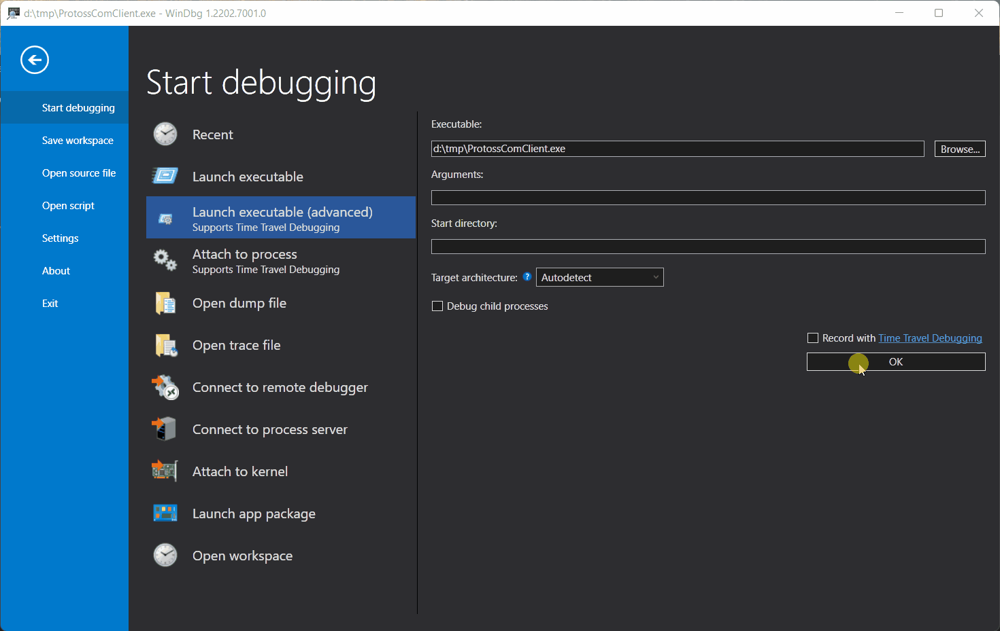

# comon - a WinDbg extension to trace COM


**Comon** is a WinDbg extension that can help you trace COM interactions (COM class creations and interface querying). You may use it to investigate various COM issues and better understand application logic. During a debugging session, comon will record virtual table addresses (for the newly created COM objects) and allow you to query them or even set breakpoints on COM interface methods. If COM metadata is available (either in the registry or in a standalone TLB/DLL file), you may load it into comon, and it will automatically decode COM identifiers.

Check [**the documentation**](https://wtrace.net/documentation/comon) to learn more.



## Available commands:

```
  !cometa index
      - indexes COM metadata found in the system (registered type libraries, CLSIDs,
        and interfaces). The results are saved to a cometa.db3 file in the user temporary
        folder. They should be automatically loaded on the next run.
  !cometa index <path_to_tlb_or_dll_file>
      - indexes COM metadata from the provided TLB or DLL file. The results are saved
        to a cometa.db3 file in the user temporary folder. They should be automatically
        loaded on the next run.

  !cometa showi <iid>
      - shows information about a given IID (COM interface ID). This command will show
        interface methods (if available) and virtual tables registered for this IID.
  !cometa showc <clsid>
      - shows virtual tables registered for a given CLSID (COM class ID)

  !comon attach [[-i|-e] {clsid1} {clsid2} ...]
      - starts COM monitor for the active process. If you're debugging a 32-bit WOW64
        process in a 64-bit debugger, make sure you set the effective CPU architecture to x86
        (.effmach x86), use -i to configure an including filter (monitors only the provided CLSIDs)
        or -e to configure an excluding filter (monitors all CLSIDs except for the provided ones)
  !comon detach
      - stops COM monitor for the active process.
  !comon pause
      - pauses COM monitoring for the active process.
  !comon resume
      - resumes COM monitoring for the active process.
  !comon status
      - shows the current monitoring status. It also lists all the virtual tables registered
        for a given process providing their IIDs and CLSIDs

  !coreg <clsid> <iid> <vtable_address>
      - manually add a virtual table address to the COM monitor and bind them with
        a given COM interface (IID) and COM class (CLSID)
```

## Building

Comon is built with CMake, using [vcpkg](https://vcpkg.io) as a package manager.

You may use one of the CMake presets to build a specific configuration, for example:

```
cmake --preset=ninja-x64-release
cmake --build --preset=ninja-x64-release
```
